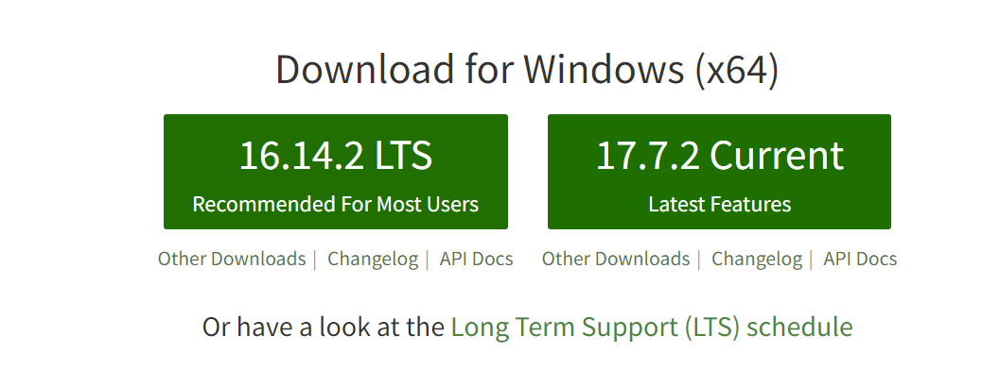
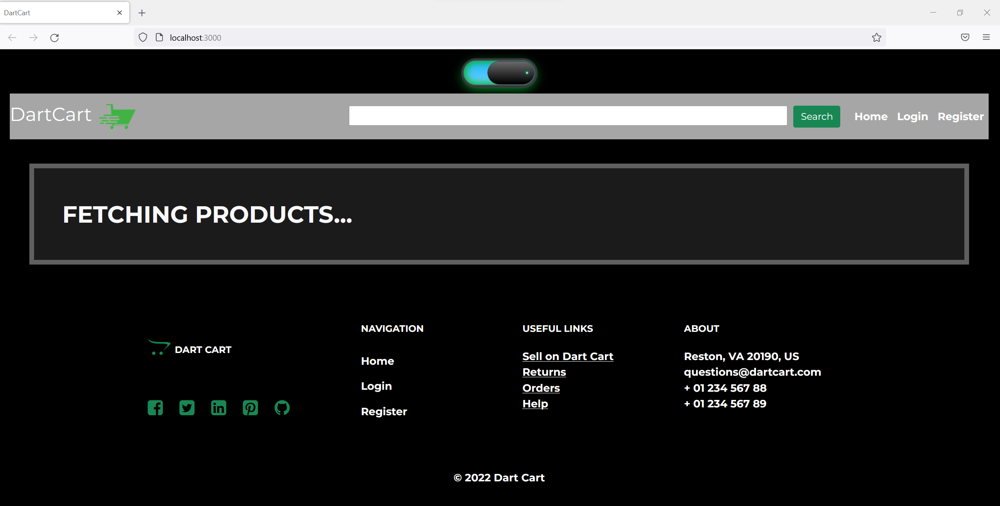

# DartCart-Client
Note: This is the front-end portion of the DartCart Application. The required back-end portion can be found here: https://github.com/Revature-DartCart/DartCart-Server

## Project Description
 
DartCart is an e-commerce web application designed to buy and sell products developed with Full Stack Development. The Client-side section of DartCart represents the front-end side, where Users can interact with the application and is written using TypeScript and React.

## Technologies Used

* TypeScript
* Node
* React
  * React Router
  * React Bootstrap
  * React Testing Library
* Redux
* Axios

## Features

* Create and Login with an Account.
* Browse for products by Type, Category, and Supplier.
* Add items to your cart and checkout items.
* Add items to be sold onto the market.
* View previous order and transaction details.

## Getting Started

The first step is to clone the Client repo. To do this, open a git bash window in the folder you wish to save the project and run the following command using this link:

$ git clone https://github.com/Revature-DartCart-2/DartCart-Client.git

Next, you must go to https://nodejs.org/en/?msclkid=e1737570a88911ec9b5ea557841437a2 and complete the download process.

Now that you have everything you need on your computer, open a git bash window in the data-cart-client folder.

and run the command "install node"

In the same directory:

### `npm start`

Runs the app in the development mode. 
Open [http://localhost:3000](http://localhost:3000) to view it in the browser.

The page will reload if you make edits. 
You will also see any lint errors in the console.

Your browser will automaticall open for you, and you are all set.

## Usage

> Here, you instruct other people on how to use your project after they’ve installed it. This would also be a good place to include screenshots of your project in action.

## Contributors

* Abdul Samad Sadat
* Alejandro Gomez
* Anthony Davis
* Artur Weinstein
* Ben Karlsberg
* Candido Ramirez
* Clyde Griffin
* David Melanson Jr
* Dom Scanga
* Jack Linhart
* John Salguero
* Josh Harms
* Joshua Herrera
* Kainalu Barino
* Leland Warner
* Michael Ord
* Richard Simpson
* Robert Davis
* Ryan Haque
* Tanner Nielsen
* Thanh Nguyen
* Tomas Abebaw Anbessaw

This project was made for the Revature Winter Batch 2022.
