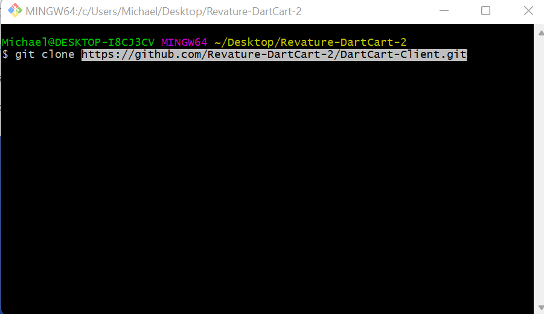
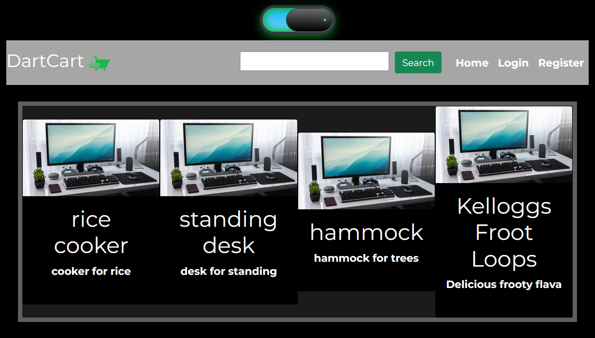
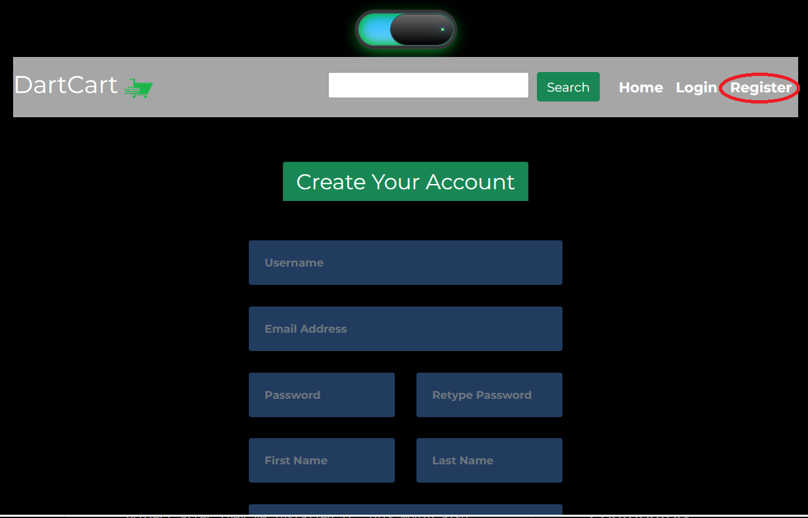
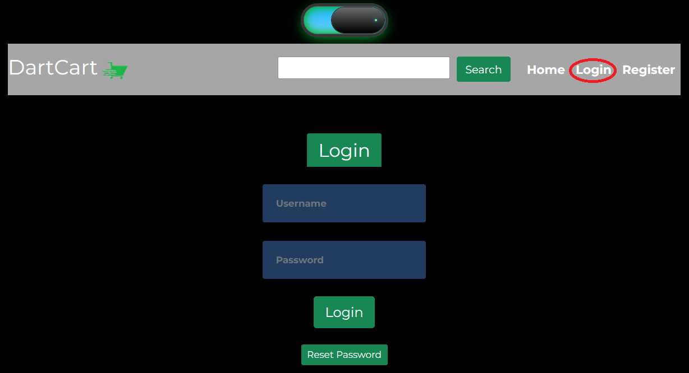
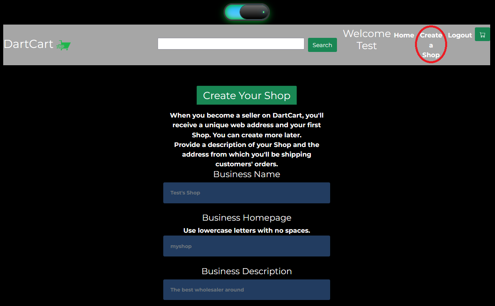
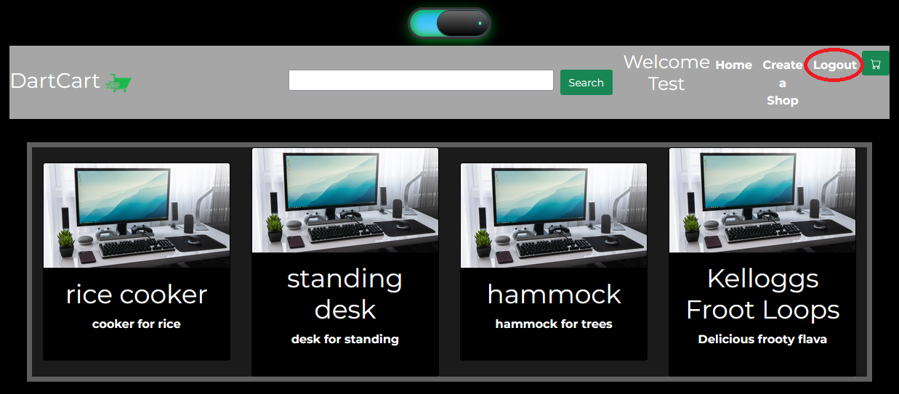

# DartCart-Client
Note: This is the front-end portion of the DartCart Application. The required back-end portion can be found here: https://github.com/Revature-DartCart-2/DartCart-Server

## Project Description
 
DartCart is an e-commerce web application designed to buy and sell products developed with Full Stack Development. The Client-side section of DartCart represents the front-end side, where Users can interact with the application and is written using TypeScript and React.

## Technologies Used

* TypeScript
* Node
* React
  * React Router
  * React Bootstrap
  * React Testing Library
* Redux
* Axios

## Features

* Create and Login with an Account.
* Browse for products by Type, Category, and Supplier.
* Add items to your cart and checkout items.
* Add items to be sold onto the market.
* View previous order and transaction details.

## Getting Started

The first step is to clone the Client repo. To do this, open a git bash window in the folder you wish to save the project and run the following command using this link:

$ git clone https://github.com/Revature-DartCart-2/DartCart-Client.git

First, you must go to node.js and complete the download steps based on your device.

Next, you will want to 
   
In the project directory, you can run:

### `npm start`

Runs the app in the development mode. 
Open [http://localhost:3000](http://localhost:3000) to view it in the browser.

The page will reload if you make edits. 
You will also see any lint errors in the console.

### `npm test`

Launches the test runner in the interactive watch mode. 
See the section about [running tests](https://facebook.github.io/create-react-app/docs/running-tests) for more information.

### `npm run build`

Builds the app for production to the `build` folder. 
It correctly bundles React in production mode and optimizes the build for the best performance.

The build is minified and the filenames include the hashes. 
Your app is ready to be deployed!

See the section about [deployment](https://facebook.github.io/create-react-app/docs/deployment) for more information.

### `npm run eject`

**Note: this is a one-way operation. Once you `eject`, you can’t go back!**

If you aren’t satisfied with the build tool and configuration choices, you can `eject` at any time. This command will remove the single build dependency from your project.

Instead, it will copy all the configuration files and the transitive dependencies (webpack, Babel, ESLint, etc) right into your project so you have full control over them. All of the commands except `eject` will still work, but they will point to the copied scripts so you can tweak them. At this point you’re on your own.

You don’t have to ever use `eject`. The curated feature set is suitable for small and middle deployments, and you shouldn’t feel obligated to use this feature. However we understand that this tool wouldn’t be useful if you couldn’t customize it when you are ready for it.

## Usage

> Here is a guide to using the DartCart app.

* Homepage
  * This is DartCart's landing page. On this page you can view featured products and choose between light and darkmode with the switch at the top.
  

* Register
  * Register a new user by clicking the Register button and fill out the new account registration form.
  

* Login
  * Once a user is registered, they are automaticly logged in to the app. On subsequent visits the user must login before they can use the app.
  

* Create a Shop
  * If the user is wanting to sell products on DartCart, a shop can be made by clicking the Create a Shop button and filling out the registration form.
  

* Logout
  * When the user leaves the app, be sure to close the connection to their account by clicking the Logout button.
  
  

## Contributors of first iteration (DartCart 1)

* Abdul Samad Sadat
* Alejandro Gomez
* Anthony Davis
* Artur Weinstein
* Ben Karlsberg
* Candido Ramirez
* Clyde Griffin
* David Melanson Jr
* Dom Scanga
* Jack Linhart
* John Salguero
* Josh Harms
* Joshua Herrera
* Kainalu Barino
* Leland Warner
* Michael Ord
* Richard Simpson
* Robert Davis
* Ryan Haque
* Tanner Nielsen
* Thanh Nguyen
* Tomas Abebaw Anbessaw

## Contributers of second iteration (DartCart 2)

* Andy Escobar
* Andrew Snyder
* Austin Ristau
* Hannah Hospital
* Austin McGehee
* Austin Blandford
* Awaab Elamin
* Brandon Clark
* Michael Bronzo
* Christian Mains
* Philip Wentworth
* Gurman Singh
* Jacob Sotto
* Paul Agilpay
* Mike Campbell
* Lamar Lewis
* Robert Lavoie
* Scott Damon
* Tracy Bodine
* Joshua Robles
Dart Cart 2 was made for the Revature Java/React 1/24 batch